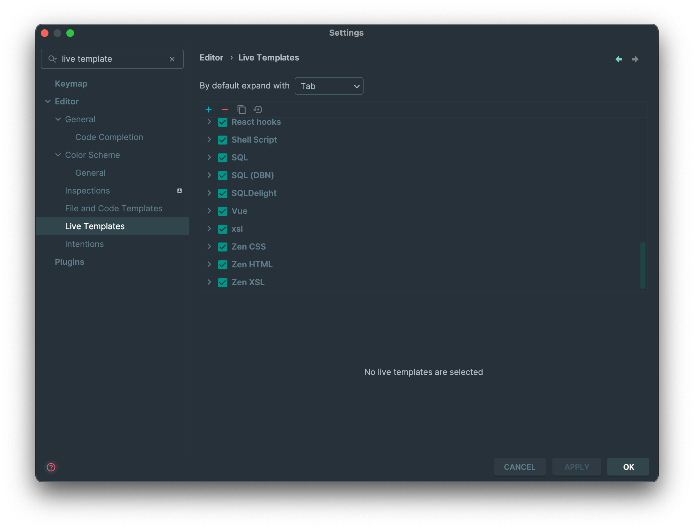
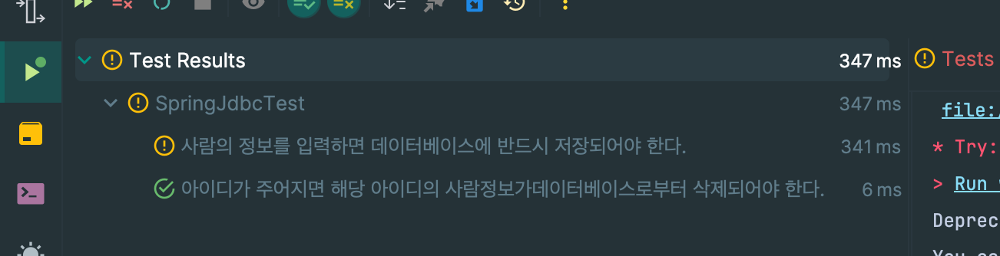

# spring server settings 🎔
build gragle code

```
 plugins {
    id 'java'
    id 'org.springframework.boot' version '2.7.10'
    id 'io.spring.dependency-management' version '1.0.15.RELEASE'
}

group = 'com.spring'
version = '0.0.1-SNAPSHOT'
sourceCompatibility = '11'

configurations {
    compileOnly {
        extendsFrom annotationProcessor
    }
}

repositories {
    mavenCentral()
}

dependencies {
    implementation 'org.springframework.boot:spring-boot-starter-web'
    compileOnly 'org.projectlombok:lombok'
    annotationProcessor 'org.projectlombok:lombok'
    testImplementation 'org.springframework.boot:spring-boot-starter-test'
    
      //jsp 라이브러리 추가 dependency 안에 있어야 함!
    implementation 'javax.servlet:jstl'
    implementation 'org.apache.tomcat.embed:tomcat-embed-jasper'

    //마리아디비 커넥터
    implementation 'org.mariadb.jdbc:mariadb-java-client:3.3.3'

    //SpringJDBC 모듈
    implementation 'org.springframework.boot:spring-boot-starter-jdbc'
}

tasks.named('test') {
    useJUnitPlatform()
}
```

**톰캣 실행 - 아래와 같은 에러 발생**

org.springframework.beans.factory.BeanCreationException: Error creating bean with name 'dataSource' defined in class path resource [org/springframework/boot/autoconfigure/jdbc/DataSourceConfiguration$Hikari.class]: Bean instantiation via factory method failed; nested exception is org.springframework.beans.BeanInstantiationException: Failed to instantiate [com.zaxxer.hikari.HikariDataSource]: Factory method 'dataSource' threw exception; nested exception is org.springframework.boot.autoconfigure.jdbc.DataSourceProperties$DataSourceBeanCreationException: Failed to determine a suitable driver class
2024-05-17 11:15:25.073  INFO 14822 --- [           main] o.apache.catalina.core.StandardService   : Stopping service [Tomcat]
<br><br>
2024-05-17 11:15:25.080  INFO 14822 --- [           main] ConditionEvaluationReportLoggingListener :
<br><br>
Error starting ApplicationContext. To display the conditions report re-run your application with 'debug' enabled.
2024-05-17 11:15:25.088 ERROR 14822 --- [           main] o.s.b.d.LoggingFailureAnalysisReporter   :
<br><br>
***************************
APPLICATION FAILED TO START
***************************

Description:

Failed to configure a DataSource: 'url' attribute is not specified and no embedded datasource could be configured.

Reason: Failed to determine a suitable driver class


Action:

Consider the following:
If you want an embedded database (H2, HSQL or Derby), please put it on the classpath.
If you have database settings to be loaded from a particular profile you may need to activate it (no profiles are currently active).


Process finished with exit code 1

**데이터베이스 기본설정 잡기**
* application.properties에 setting code 추가
* 포트번호, 스키마, 비밀번호 다시한번 확인
```angular2html
# datasource setting
# uri가 정확하지 않으면 (예를들어 db 이름이 없는 이름일 경우)
spring.datasource.url=jdbc:mariadb://localhost:3306??/spring??
spring.datasource.username=??
spring.datasource.password=??
spring.datasource.driver-class-name=org.mariadb.jdbc.Driver
```
**unit test intelliJ Live template settings**

editer -> live template -> select java -> add live template -> adjust template name -> add code -> **Define everywhere**
```angular2html

@Test
@DisplayName("$description$")
void $NAME$() {
    //given
    $givenData$
    //when
    
    //then
}
```


**unit test example**
```angular2html
package com.study.springstudy.database.chap01;

import org.junit.jupiter.api.DisplayName;
import org.junit.jupiter.api.Test;
import org.springframework.beans.factory.annotation.Autowired;
import org.springframework.boot.test.context.SpringBootTest;

import static org.junit.jupiter.api.Assertions.*;
@SpringBootTest
class SpringJdbcTest {

    @Autowired //test시 default로 필드 주입
    SpringJdbc springJdbc;

    //기능 단위 테스트 framework JUnit5
    // test = assertion (단언)
    @Test
    @DisplayName("사람의 정보를 입력하면 데이터베이스에 반드시 저장되어야 한다. ")
    void saveTest() {
        //gwt 패턴
        //given : 테스트에 주어질 데이터
        Person p = new Person(6, "육", 6);

        //when : 테스트 상황
        int result = springJdbc.save(p);

        //then : 테스트 결과 단언
        assertEquals(1, result);

    }

}

```
**! : assert fail** 
